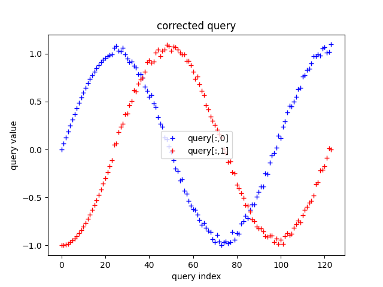

# gpx_tools

A tool and background on fusing GPX files for the purpose of correcting missing parts of the track. Especially useful for mending a Strava activity when you have stopped for a snack, and forgotten to restart your GPS tracking device - and you are with someone who has not done this! This seems to happen to me all the time.

Note: this file uses LaTex support recently provided by Github. Sometimes these equations do not render, and you will see strange things with backslashes and odd looking bits (raw LaTex). If this is the case, reload the page in your browser.

## Installation

## A non-GPX example (building on the dtw-python unit tests)

### DTW in action

An example of two trajectories with similar paths can be constructed as follows. We have two trajectories which move along the unit circle for a single circuit - and so of length $ 2\pi $, but which are out of phase by $ \pi / 2 $ - in particular the 'query' trajectory lags the 'reference' (or template). Using the dtw-python module, we can align these two trajectories via dynamic time warping - which is a global alignment based on euclidean distances between the two point sets. The alignment for this case is shown in figure 1:

 
<figure>
    
    <figcaption>Fig. 1: a DTW alignment between two unit-circular trajectories out of phase by $ \pi / 2 $ </figcaption>
     
</figure>
 

Note also that the query trajectory is noisy - a typical case for any real data - especially GPS data, and that the reference trajectory is noise-free. Also note that these trajectories have no time stamps, unlike typical GPX files.

As the alignment plot shows, these two trajectories have a shared central portion, but each extend past each other $ \pi / 2 $ - or a quarter of their circuit, at each end. These are the regions of no progress in either the reference or the query - the points at these unshared ends are all aligned to the same terminal index of the central aligned region. What we want our query correction algorithm to do is merge these two trajectories into one.

### Design preferences

 For the purposes of repairing Strava activities, there are two design preferences. First, one of the trajectories needs to be preferred in the result. For example, if I am correcting my activity, I would prefer that the output is composed of the original data from my activity as much as possible. Second, when using data from either activity (the reference or template), I would prefer that data to be unchanged from the original. In other words, all data is as raw as possible.  This is easily accomplished (and satisfied by the data) when I assume the two trajectories represent two individuals participating in the same activity at the same time. If these activities are at different times - we need to do additional correction of time stamps in the GPX file - which is not necessarily that hard to do, but for future work. This desire to include raw data in the output also makes it simple to consider how to include other data, like heart rate or temperature, which may be included in the GPX file. And, in general, if you can avoid making up data, do so! Note that if we are going to correct missing data in one trajectory, it makes no sense to interpolate points, either - in addition to this being a form of making up data! Third, the algorithm should handle fairly complex trajectories which might pass through the same points - in any order or number of times. This argues for an alignment process, like DTW.

### The correction algorithm
A simple algorithm to satisfy the design preferences, where we have a preference for the query trajectory, is:
<ol>
<li> Assign the query to the output trajectory via the DTW alignment index for the query.</li>
<li> Assign portions of the reference to the output when the reference trajectory is missing in the query via the DTW alignment index for the reference. This corresponds to sections of the alignment which are vertical in figure 1.</li>
<li>Eliminate repeated points in the output. Different spatial sampling intervals (and misaligned points) in the reference and query trajectories will result in points in one trajectory mapping to multiple points in the other trajectory.</li>
</ol>

Some experimentation with this process with real GPX data (see below), suggests that deciding on when the reference trajectory points are missing from the alignment merely by looking at the alignment index is problematic and results in fidgety identification of missing regions of one trajectory. Part of the problem is that GPX trajectories can have very different spatial sampling - due to device settings - and this smears out the beginnings and ends of missing regions. One solution is to choose a distance threshold - and find the connected regions in the alignment where the two trajectories exceed this threshold. Then, for each connected region, choose to insert the reference points in the output only if the reference sampling is more than the query sampling in that region. In the synthetic example, that means only the initial section of the reference is inserted in the output - since the query advances by zero points in that region.

A downside of this is now we have a nuisance parameter - the distance threshold. Since sampling intervals in real GPX data are quite complex - it is also not entirely clear (at this point) how to determine this from the data. However, I find that a distance threshold of 50m works fairly well for the mountain biking data included here. For the circular trajectory, I use robust (SMAD) statistics of the distance increments along the query. In a trajectory with a few large distance gaps in the query, the robust statistics will ignore the large values.

### Back to the example

The circular trajectory is repaired via the correction algorithm into the trajectory in figure 2:

 
<figure>
    
    <figcaption>Fig. 2: the corrected query trajectory. Note the trajectory includes the initial noise-free reference trajectory
    </figcaption>
     
</figure>
 

## GPX example

The typical usage model for the edit_gpx tool is to mend GPX tools obtained from Strava - when I am using this, I download my own GPX file of a damaged activity, and then ask whomever I rode or ran the activity with to send me the GPX file of their corresponding activity. Although Strava settings can be adjusted, I have found that typically a complete GPX file is only produced by the owner of the activity on Strava.

An example of the repair of an activity at Calero County Park in California is shown in the following link (I suggest you open it in another tab or window so that you can read along with the comments here. At the time of writing it did not seem possible to get the README.md rendered page to render this interactive folium map):

[fixed gpx example](https://stuartgjohnson.github.io/gpx_tools/test/calero_fixed.html)

In this example, there are three routes plotted. My route, the query, is in dashed red. My friend's route (provided here with his permission) is dashed blue. The corrected route is solid green. Note you should be able to zoom in and out on this map/route in your browser. You should see that the route is almost always showing the red dashes and the green together - recall the query (my route) is preferred. The fix is in the section near Bald Peaks - where I forgot to restart my device at the snack stop at the top of the climb up Longwall Canyon Trail. In that section the fixed route tracks my friend's ride along Bald Peaks Trail.

