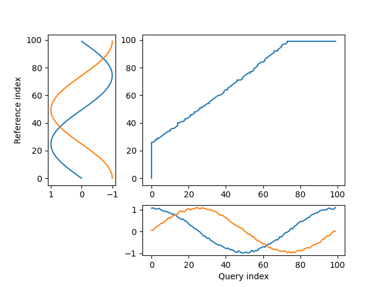

# gpx_tools
A tool and background on fusing GPX files for the purpose of correcting missing parts of the track. Especially useful for mending a Strava activity when you have stopped for a snack, and forgotten to restart your GPS tracking device - and you are with someone who has not done this! This seems to happen to me all the time.

Note: this file uses LaTex support recently provided by Github. Sometimes these equations do not render, and you will see strange things with backslashes and odd looking bits (raw LaTex). If this is the case, reload the page in your browser.

## Installation

## A non-GPX example (building on the dtw-python unit tests)

An example of two trajectories with similar paths can be constructed as follows. We have two trajectories which move along the unit circle for a single circuit - and so of length $ 2\pi $, but which are out of phase by $ \pi / 2 $ - in particular the 'query' trajectory lags the 'reference' (or template). Using the dtw-python module, we can align these two trajectories via dynamic time warping - which is a global alignment based on euclidean distances between the two point sets. The alignment for this case is shown in figure 1:

<figure>
    
    <figcaption>Fig. 1: a DTW alignment between two unit-circular trajectories out of phase by $ \pi / 2 $ </figcaption>
</figure>

Note also that the query trajectory is noisy - a typical case for any real data - especially GPS data, and that the reference trajectory is noise-free.

[fixed gpx example](https://stuartgjohnson.github.io/gpx_tools/test/calero_fixed.html)

Where $x = 0$, evaluate $x + 1$.
$$ \vec{r}_0 = (-x_0,0), x_0 > 0 $$
